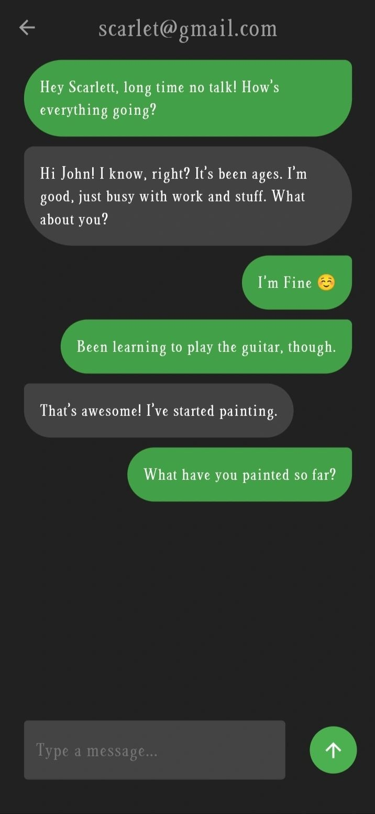
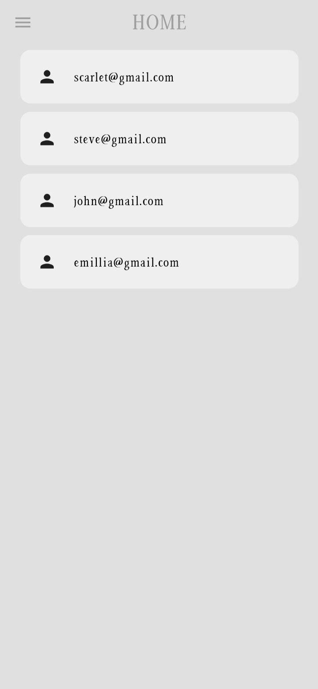
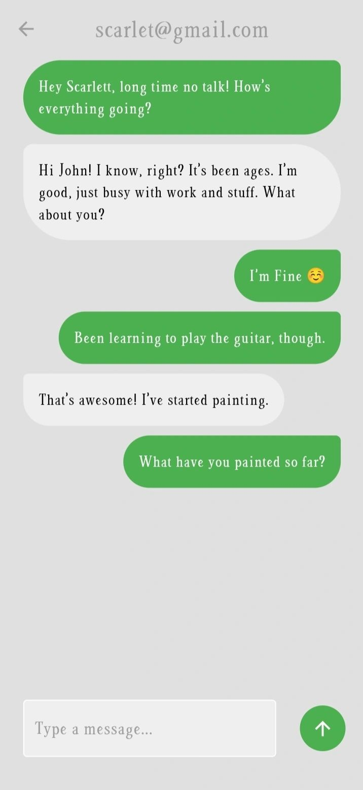
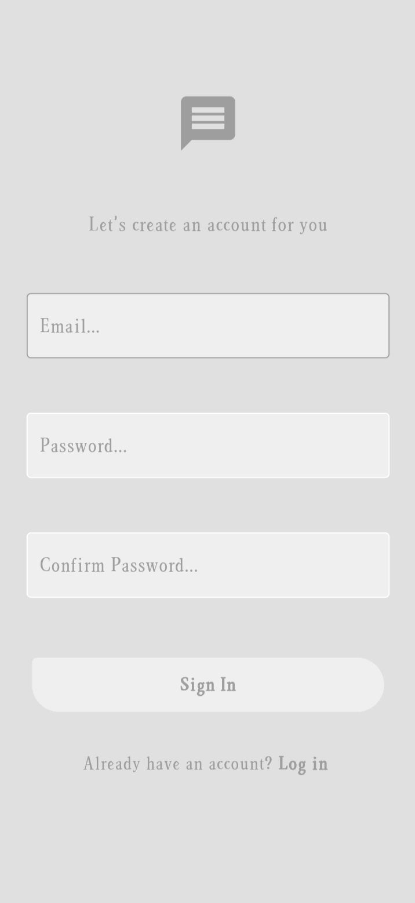
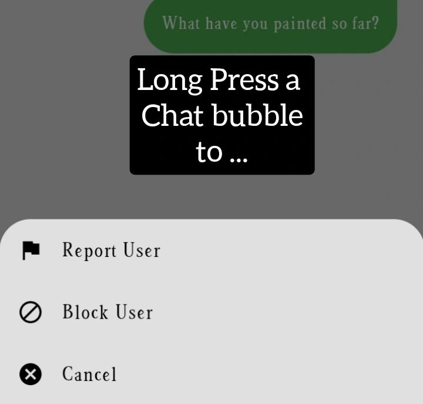

<!-- Screenshots -->

  

---

# 💬 Messenger App – Flutter & Firebase Powered

### A cross-platform, real-time chat application built with **Flutter** and **Firebase**, designed for seamless communication with a clean UI and strong backend integration.

---

## 📘 Project Description

This Messenger App is a secure, scalable, and user-friendly real-time messaging platform. It supports one-on-one chat functionality, dark/light themes, user authentication, and user behavior reporting. Built using Firebase's powerful backend services, the app demonstrates practical implementation of real-time databases, authentication, and cloud functions within a modern Flutter UI.

---

## ✨ Features

- 🔒 **Secure Firebase Authentication** (Email/Password)
- 💬 **Real-Time Messaging** with instant updates
- 🌗 **Dark & Light Mode** UI support
- 🧾 **User Reporting System** for enhanced community moderation
- 🏠 **Home Feed** displaying recent conversations
- 🔄 **Auto Syncing** across devices with Cloud Firestore
- 📱 **Responsive Design** for Android & iOS
- ⚙️ **Clean Codebase** following best practices (separation of concerns, reusable widgets)

---

## 🤝 Contribution

We welcome contributions from developers of all skill levels!

To contribute:

1. Fork the repository.
2. Clone your forked repo.
3. Create a new branch: `git checkout -b feature-name`
4. Commit your changes: `git commit -m "Add some feature"`
5. Push to the branch: `git push origin feature-name`
6. Create a Pull Request.

Please follow conventional commit messages and maintain code formatting for smooth collaboration.

---

## 🙏 Thank You

Thank you for exploring this project! Whether you're an HR professional evaluating technical capabilities or a developer seeking collaboration, I appreciate your time and interest.

Feel free to connect via [LinkedIn](https://www.linkedin.com/in/bershayit/) or [email](bershayit@gmail.com) for any queries or discussions.

---

> **#Flutter #Firebase #ChatApp #CrossPlatform #RealTimeMessaging**
